# Docker and Kubernetes: The Complete Guide Notes

This file contains all of the notes taken during the completion of the Docker and Kubernetes: The Complete Guide course by Stephen Grider on Udemy. The course can be found [here](https://www.udemy.com/course/docker-and-kubernetes-the-complete-guide/).

## Section 1: Dive Into Docker

* Docker is used to make installing and using software on a computer easier
* Docker is a platform or ecosystem around creating and running containers
* The Docker ecosystem consists of a few different things
  * Docker Client (also known as the Docker CLI)
    * Docker Client is the tool used to issue docker commands
  * Docker Server (also known as the Docker Daemon)
    * Docker Server is responsible for creating images, running containers, ect...
  * Docker Machine
  * Docker Images
    * A file system snapshot and a start command specifying how to start the process that will run in a container
  * Docker Hub
    * Docker Hub is a repository of free public images that one can freely download and run on a computer
  * Docker Compose
* An image consists of a single file containing all of the dependencies and configuration required to run a program
* A container is an instance of an image and runs a program
  * It is a program with its own isolated set of hardware resources
  
The below are the steps that occur after running `docker run hello-world`

1. The Docker Client is started and contacts the Docker Daemon.
2. The Docker Server sees that we are trying to start the hello-world image. Docker Server first checks if the hello-world image already exists on the computer by checking the image cache.
3. Because the image did not already exist in the image cache, Docker Server downloaded the image from Docker Hub into the image cache.
4. The Docker Daemon then created a new container from the downloaded image that runs an executable that produces the message seen in the terminal after executing the `docker run hello-world` command.
5. The Docker Daemon then streamed the output from the container to the Docker Client, which sent it to our terminal, resulting in the displaying of the message in the terminal.


* Operating systems have a kernel, which is a running process that governs between all of the programs running on a computer and the physical hardware resources available to the computer
  * ie. When writing a file to a hard drive using nodejs, nodejs informs the kernel that it wants to write to the hard drive and the kernel take the needed information and writes it to the hard drive for the nodejs process
* Programs interact with the kernel via system calls, which are requests to interact with a piece of hardware
* Namespacing: allows the isolation of resources per process (or group of processes)
  * The kernel can then look at what application is making a system call and use the correct segment of the hardware resource for that application
  * Not only used in hardware, but also software
* Control Groups (cgroupsl): allow the limiting of resources used per process

### So, what is a container?
* A container contains a running process that sends a system call to a kernel which directs the system call to a specific portion of hardware resources
* A portion of the systems hardware resources are made available to containers
* Containers are created from images, which are file system snapshots (which are essentially a copy/paste of a specific set of directories and/or files) and a start command informing how to start the process that will run in the container


## Section 2: Manipulating Containers with the Docker Client

### Docker run in detail


* After specifying the image name, we can supply a command to override the default run command of the container we are attempting to run
* The `docker run` command is identical to running the `docker create` and `docker start` commands together in that order
* Executing `docker run`  with the `-d` flag will start that container in the background


* `docker create` prepares an images file snapshot for use within a container
  * After running `docker create`, the id of the container create will be output for use with the `docker start` command
* `docker start` executes the run commands specified within an image
  * Using the `-a` flag will print out any output generated from running the container, not using the flag will result in the id of the container being output

### Listing Running Containers

* A list of running Docker containers can be displayed by running the `docker ps` command
* Running `docker ps --all` will display all containers that we have ever created, not just the ones that are currently running

### Restarting Containers

* To restart a stopped container, we can run the `docker start` command using the stopped containers id
  * When restarting a stopped container, the command used when originally starting the container will be used. This means that if an override command was used to originally start the container, that command will be the command that is used when restarting the container

### Removing Stopped Containers

* To remove stopped containers, we can run `docker system prune`, which will remove all stopped containers, all networks not used by at least one container, all dangling images and the build cache (downloaded images)

### Retrieving Log Outputs From Containers

* To get logs from a container we can use the `docker logs` command

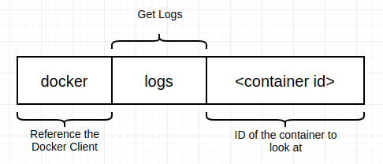

### Stopping Running Containers

* To stop a running container, we can run the command `docker stop` or `docker kill`
* The following diagram lays out what occurs when the `docker stop` command is executed on a container

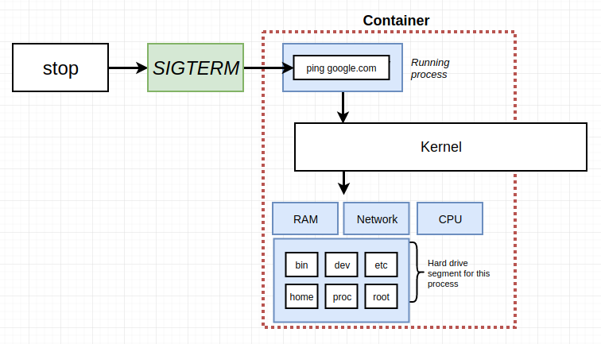

* Containers are stopped by issuing a SIGTERM or SIGKILL command (done automatically by `docker stop` or `docker kill` respectively)
  * SIGTERM is a command that can be issued to a docker container to stop the container and is issued upon running `docker stop`
    * It gives the process a little bit of time to shut itself down and perform any necessary cleanup
    * Many programming languages can listen for the SIGTERM command to be issued and perform any cleanup before ending execution
    * If a container fails to respond to a `docker stop` within 10 seconds, Docker will automatically run the `docker kill` command on the container
  * SIGKILL is another command that can be issued to a docker container to stop the container and is issued upon running `docker kill`
    * It tells the container to shut down immediately without any time to do any additional work/cleanup

### Multi-command Containers

* Commands can be issued within a docker container using `docker exec`

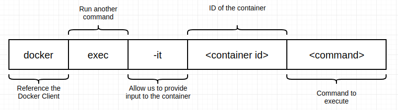

* The `-it` flag allows us to type input directly into the container
  * The `-i` flag attaches our terminal to the stdin process of the new running process (ie. bash, redis-cli)
  * The `-t` flag ensures that all of the text being input/output to the process are output in a nice format (the format we expect from running that process will not appear when not using the `-t` flag and only using the `-i` flag)
* Using the `docker exec` command with the `-it` flag, we can execute a shell within our container
  * For example, running `docker exec -it <container_id> bash` will give us access to a bash shell within our container
  * It is also possible to open a shell when starting a container (this will override the default command) by running `docker run -it <image_name> sh` (sh can be replaced with bash/zsh/etc... if available within that container)
    * Typically we will want to start our container using its default command and `docker exec` in a shell within our running container

## Section 3: Building Custom Images Through Docker Server

### Creating Docker Images

* To create a custom Docker image, we need to create a Dockerfile
  * A Dockerfile is a plain text file that has contains configuration specifying how our container will behave

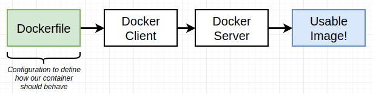

* Inside of a Dockerfile, we need to specify a base image, commands to install additional programs and a command to run on container startup

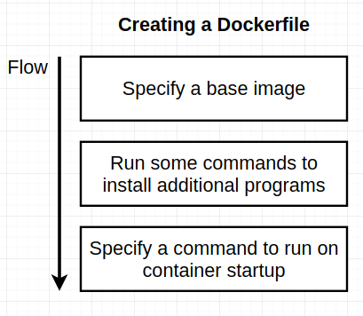

* Below is an example of a Dockerfile that creates an image that runs redis-server

```Dockerfile
# Use an existing docker image as a base
FROM alpine

# Download and install a dependency
RUN apk add --update redis

# Tell the image what to do when it starts as a container
CMD ["redis-server"]
```

* The image specified by the above Dockerfile can then be built by navigating the the directory containing the Dockerfile and running `docker build .`


* The most important Dockerfile instructions to understand and know are `FROM`, `RUN`, and `CMD`
  * The `FROM` instruction specifies what image we want to use as a base for our custom image
  * The `RUN` instruction is used to execute some command while preparing our custom image
  * The `CMD` specifies what command to run when starting our container

### What's a Base Image?

* Writing a Dockerfile == Being given a computer with no OS and being told to install Chrome
* The flow of installing chrome when given a computer with no operating system can be related with writing a Dockerfile in the following way:

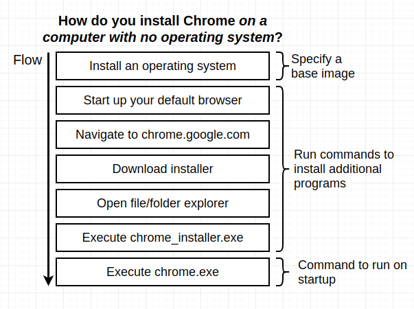

* The base image is the initial starting point for a Docker image

### The Build Process In Detail

* Below is a diagram outlining the steps that occur when running `docker build` on our Dockerfile

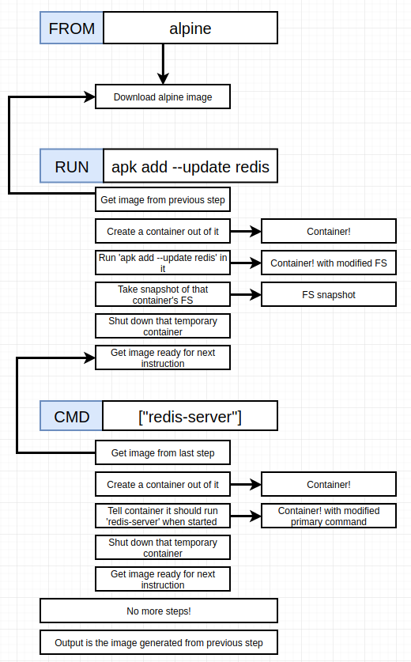

* When rebuilding docker images from dockerfiles, only the steps from the first changed line down will be run
  * This is because Docker caches the steps of building a docker container and uses previously build intermediate images when rebuilding docker images

### Tagging an Image

* Tagging an image allows us to run custom docker containers without the need of having the images id
  * Images can be tagged using the `-t` flag when running `docker build`
* The convention for tagging images is as follows:


* Thus, runnin the command `docker build -t trentgillis/redis:latest .` will allow us to run our container by using `docker run trentgillis/redis:latest` rather than using the images id
  * If we do not put a version at the end of our tag, latest will be used by default
  * Technically, the tag for an image is just the version with the other parts being just the Docker ID and the repository for that image
  
* It is also possible to create images from docker containers
  * ie. we can run a container manually and then create an image from that container
  * Images can be created from containers using the `docker commit` command
  * An example of the use of the `docker commit` command is as follows: `docker commit -c 'CMD ["redis-server"]' 4e5adc049458`
    * The `-c` flag allows us to specify the default command for the created image
    * The `4e5adc049458` argument passed to `docker commit` is the ID of the running container we want to create the image from

## Section 4: Making Real Projects with Docker

* When using base images, the `alpine` tag signifies an image that is as small and compact as possible
* When working with project files, none of the project files used in a project are available within the docker container by default
  * To make files available within our Docker containers, we need to make use of the `COPY` instruction in our Dockerfile
  
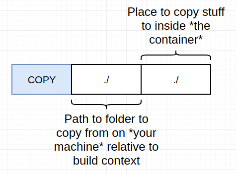

* By default, no traffic coming into our localhost network is routed into our container
  * Out Docker container has its own set of isolated ports, but by default, traffic to ports on the host computer are not routed to the ports of the docker container. To fix this we need to setup port mappings between the host machine and the docker container
  * A port mapping tells the host machine to automatically route requests to a certain port to a port inside of the docker container
  * Setting up port mappings is a change made to the `docker run` command used to start the container
    * To setup a port mapping we add the  `-p` flag to the `docker run` command

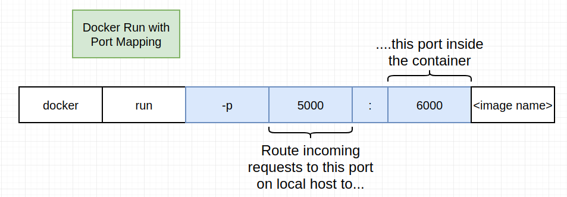

* The localhost and container ports in the port mapping do not need to be identical
  * For example, we can direct traffic to port 5000 on the host machine to port 8080 in the Docker container

* By default, files copied into the container using the `COPY` instruction are copied into the root directory of the docker container. THIS IS NOT BEST PRACTICE!
  * We can use the `WORKDIR` instruction to specify a working directory within the docker container to copy all of our project files to
  
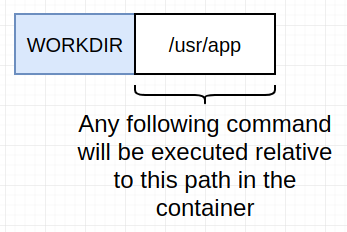

* The usr directory is a safe place to put our applications, however it is not completely agreed upon which directory is the best place for an app to live inside of a docker container

* In order to avoid unnecessary steps when rebuilding docker images, smartly ordering the commands can help with quick docker image rebuilds by taking advantage of the way that caching works
  * ie. copy package.json into the container, run npm install and then copy the rest of the files into the image. This will result in not needing to run npm install every time a change occurs in the non-package.json project files

## Section 5: Docker Compose with Multiple Local Containers

* Docker Compose is a separate CLI that is used to start up multiple Docker containers at the same time
  * It automates some of the long-winded arguments we were passing to `docker run`
* The docker-compose.yml contains all of the options we'd normally pass to docker-cli

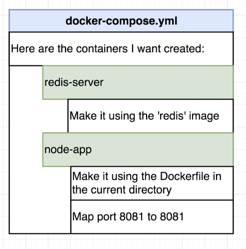

* `services` in a docker compose file can be thought of as services
* Docker Compose automatically sets up networks connecting docker containers
* Below is an example of a docker-compose.yml file 

```Dockerfile
version: '3'
# Services can be thought of as individual docker containers
services: 
  redis-server:
    # Image allows us to specify the image being used for that docker container
    image: 'redis'
  node-app:
    restart: always
    # Build allows us to specify a directory with a Dockerfile to build the image from to be used
    # for the creation of the container
    build: .
    ports:
      # First number is the port on our local machine and the second number is the port within the container
      - '8081:8081'
```

* Running `docker-compose up` is like running `docker run myimage`
* Running `docker-compose up --build` is like running `docker build .` followed by `docker run myimage`
* Running `docker-compose up -d` will start the containers in the background
* Running `docker-compose down` will stop all of the running containers specified in the docker compose file

### Automatic Container Restarts

* To automatically restart containers, we have to setup a restart policy in our `docker-compose.yml`
  * For example, to always restart the container, we can add `restart: always` to our node-app service
  * When restarting a container, Docker automatically uses the existing container and restarts the service inside of it. It does not kill the container and use a new one
  * Depending on the restart policy used, Docker will only restart containers depending on why they failed
    * ie. The `on-failure` policy will only restart the container if it crashed due to a failure
  * The restart policies available are:
    * `"no"`: Never attempt to restart this container if it stops or crashes
      * Note when using the `"no"` policy that the quotes are required (due to no being the same as false in yaml)
    * `always`: If this container stops for *any reason* always attempt to restart it
    * `on-failure`: Only restart if the container stops with an error code
    * `unless-stopped`: Always restart unless we (the developers) forcibly stop it
* The status of containers started via docker compose can be see using the `docker-compose ps` command from the same directory as the docker-compose.yml file

## Section 6: Creating a Production Grade Workflow

* A production grade workflow follows the following typical steps:
  1. Developer makes changes on a non-master (feature) branch
  2. Developer pushes changes to remote repository
  3. Developer makes pull request to merge changes on feature branch into the master branch
  4. Code is pushed to Travis CI which runs all code tests
  5. If all tests run by Travis CI run successfully, code is automatically deployed to AWS server
* Note that it is not necessary to use Docker in a production grade development workflow, but it does make a lot of the tasks associated with this workflow easier

### Building Our Development Dockerfile

* We want to make use of a separate Dockerfile for development, which we're going to call `Dockerfile.dev`
* In order to build a Docker image using a `Dockerfile.dev` Dockerfile we need to use the `-f` flag
  * For example: `docker build -f Dockerfile.dev .`
* NOTE: Due to changes to `create-react-app` we need to run our React docker containers using the `-it` flag 
  * For example: `docker run -it -p  3000:3000 CONTAINER_ID`
* To avoid having to rebuild the image every time we make a change inside of our code we need to make use of Docker volumes

### Docker Volumes

* With a Docker volume we essentially setup a placeholder inside of our Docker container that references the files and folders on our host machine
  * A volume can be thought of as a mapping between a file/folder on the host system and a file/folder inside of the Docker container
* To setup a volume inside of our containers we can use the `-v` flag
  * For example: `docker run -it -p 3000:3000 -v /app/node_modules -v $(pwd):/app IMAGE_ID`
  * The `-v $(pwd):/app` part of the above command mounts the contents of the present working directory on the host machine to the `/app` directory inside of the Docker container
  * The `-v /app/node_modules` puts a bookmark on the node_modules directory which tells Docker to not try to map the node_modules directory inside of the container to a node_modules directory on the host machine
    * To bookmark a directory, we simply need to pass the directory we want to bookmark as an argument to the `-v` flag without using the colon syntax

### Production Workflow with Docker Compose

* As our command for running out development React container becomes more complicated, it can become extremely useful to begin using `docker-compose`
* To build our Docker image using the `Dockerfile.dev` file via `docker-compose` we need to update the `build` section of our compose file to be something like the following:
  ```yaml
  build:
    context: .
    dockerfile: Dockerfile.dev
  ```
* Even though the `COPY . .` line in the development Dockerfile is not strictly necessary when using Docker Compose, it is often still worth keeping for cases where compose is not use or the Dockerfile is used as a template in the creation of a different Dockerfile where that COPY may be necessary

### Executing Test in Docker

* To run the test suite in our Docker container, we simply need to update our `RUN` command when running our container using the `Dockerfile.dev` with a different command to run our tests
  * For example: `docker run -it IMAGE_ID npm run test`
* When running our test suite, we should use the `-it` flag to attach our terminal to the containers stdin and setup a sudo terminal so that we can interact with out tests CLI inside of the container
* In order to setup automatic test reloading, we need to setup volumes in our testing Docker container in the same way we setup volumes for running the application in development
  * This can be down via a service in our `docker-compose.yaml` file, via the `-v` flag when running the container, or via a `docker exec -it  IMAGE_ID npm run test` on an already running container
* We can setup a test container via `docker-compose` by adding the following to our compose yaml:
```yaml
test:
  build:
    context: .
    dockerfile: Dockerfile.dev 
  volumes:
    - /app/node_modules
    - .:/app
  command: ["npm", "run", "test"]
```
* `docker attach` can be used to attach to the stdin, stdout and stderr of a running Docker container
* Unfortunately, there is no good way of attaching to stdin when running a test suite via Docker Compose to interact with the test suite CLI

### Running Our React App in a Production Environment

* Because we are not running our development web server when deploying our application in a production environment, we need some sort of production server to host our application
  * For this we will be using Nginx as our production web server
* In order to build our production React bundle and deploy it to Nginx, we will have to perform a multi-step Docker build
  * This multi-step build process will consist of a **Build phase** which makes use of the node:alpine base image to build the production bundles of our React application and a **Run Phase** which will make use of the Nginx base image to take the results of our build phase to host our react application on the Nginx web server
  * We can tag sections of our Dockerfile using the `as` token and passing it the name of the phase
    * For example: `FROM node:alpine as builder` tags this section of the Dockerfile with the builder phase
    * Any single phase can only have a single `FROM` statement
    * We don't have to provide a phase to the final phase of a multi-step build
  * To copy resources from a different phase, we need to use the `--from` argument to the `COPY` statement
    * For example: `FROM --phase=builder /app/build /usr/share/nginx/html`

## Section 7: Continuous Integration and Deployment with AWS

* The entire idea of TravisCI is to watch for any time we push changes to our GitHub repo where anytime we push code to GitHub, it tap on the shoulder of Travis and informs it that there is new code present in the repository
  * Once Travis has been informed that new code is present in the repository, it pull down all of the new code and then allows us the ability to do some amount of work
* TravisCI is typically used for testing and deploying codes
* In order to tell Travis what we want it to do on code pushes, we need to make use of a `.travis.yml` file
  * The `.travis.yml` file allows us to provide Travis with a set of directions telling it exactly what we want it to do
  * For our purposes, we want Travis to perform the following steps:
    1. Tell Travis we need a copy of Docker running
    2. Build our image using `Dockerfile.dev`
    3. Tell Travis how to run our test suite
    4. Tell Travis how to deploy our code to AWS
* NOTE: When running `npm run test` with CI we have to use the `-- -- coverage` option so that jest doesn't infinitely hang on the test results CLI menu
* Here is an example of a TravisCI configuration file:
```yaml
sudo: required # Sudo required tells Travis that we need superuser permissions to run this build
language: generic

services:
  - docker # Tells Travis to install docker

before_install: # Series of command before the build is run
  - docker build -t trentgillis/docker-react -f Dockerfile.dev .

script: # Series of commands to run as part of the build
  - docker run -e CI=true trentgillis/docker-react npm run test -- --coverage # Runs the tests for our React applications

deploy:
  provider: elasticbeanstalk
  region: "us-west-2"
  app: "docker-react"
  env: "DockerReact-env"
  bucket_name: elasticbeanstalk-us-west-2-425677955837 # When Travis deploys our files, it'll zip all of our files up and put them in an S3 bucket which is essentially a hard drive on AWS. This is found under the S3 service on AWS
  bucket_path: "docker-react" # Path to this apps directory inside of the S3 instance being used by elasticbeanstalk
  on:
    branch: master
  access_key_id: $AWS_ACCESS_KEY
  secret_access_key: $AWS_SECRET_KEY
```
* It's worth noting that when using AWS Elasticbeanstalk we need to add the `EXPOSE 80` command to our `Dockerfile`
  * This command actually does nothing by default, by Elasticbeanstalk will use to in order to know which ports to expose in the docker container
* Due to a bug with Elasticbeanstalk, we may need to update our `Dockerfile` to use an unnamed builder in our multi-stage containers

## Section 8: Building a Multi-Container Application
