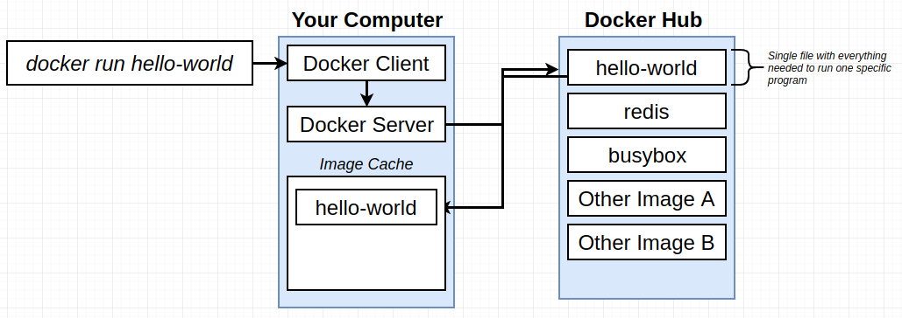
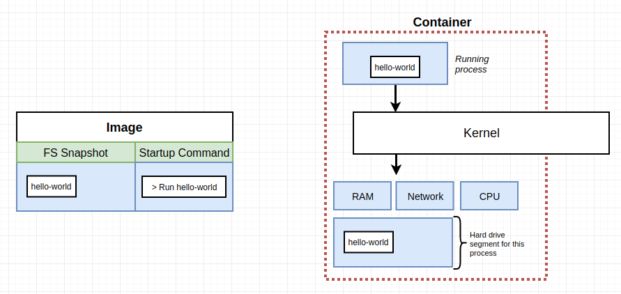
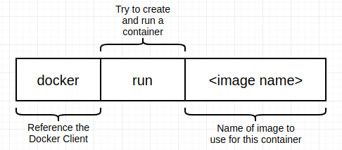

# Docker and Kubernetes: The Complete Guide Notes

This file contains all of the notes taken during the completion of the Docker and Kubernetes: The Complete Guide course by Stephen Grider on Udemy. The course can be found [here](https://www.udemy.com/course/docker-and-kubernetes-the-complete-guide/).

## Section 1: Dive Into Docker

* Docker is used to make installing and using software on a computer easier
* Docker is a platform or ecosystem around creating and running containers
* The Docker ecosystem consists of a few different things
  * Docker Client (also known as the Docker CLI)
    * Docker Client is the tool used to issue docker commands
  * Docker Server (also known as the Docker Daemon)
    * Docker Server is responsible for creating images, running containers, ect...
  * Docker Machine
  * Docker Images
    * A file system snapshot and a start command specifying how to start the process that will run in a container
  * Docker Hub
    * Docker Hub is a repository of free public images that one can freely download and run on a computer
  * Docker Compose
* An image consists of a single file containing all of the dependencies and configuration required to run a program
* A container is an instance of an image and runs a program
  * It is a program with its own isolated set of hardware resources
  
The below are the steps that occur after running `docker run hello-world`

1. The Docker Client is started and contacts the Docker Daemon.
2. The Docker Server sees that we are trying to start the hello-world image. Docker Server first checks if the hello-world image already exists on the computer by checking the image cache.
3. Because the image did not already exist in the image cache, Docker Server downloaded the image from Docker Hub into the image cache.
4. The Docker Daemon then created a new container from the downloaded image that runs an executable that produces the message seen in the terminal after executing the `docker run hello-world` command.
5. The Docker Daemon then streamed the output from the container to the Docker Client, which sent it to our terminal, resulting in the displaying of the message in the terminal.

* Operating systems have a kernel, which is a running process that governs between all of the programs running on a computer and the physical hardware resources available to the computer
  * ie. When writing a file to a hard drive using nodejs, nodejs informs the kernel that it wants to write to the hard drive and the kernel take the needed information and writes it to the hard drive for the nodejs process
* Programs interact with the kernel via system calls, which are requests to interact with a piece of hardware
* Namespacing: allows the isolation of resources per process (or group of processes)
  * The kernel can then look at what application is making a system call and use the correct segment of the hardware resource for that application
  * Not only used in hardware, but also software
* Control Groups (cgroupsl): allow the limiting of resources used per process

### So, what is a container?
* A container contains a running process that sends a system call to a kernel which directs the system call to a specific portion of hardware resources
* A portion of the systems hardware resources are made available to containers
* Containers are created from images, which are file system snapshots (which are essentially a copy/paste of a specific set of directories and/or files) and a start command informing how to start the process that will run in the container

## Section 2: Manipulating Containers with the Docker Client

### Docker run in detail

* After specifying the image name, we can supply a command to override the default run command of the container we are attempting to run

### Listing Running Containers

* A list of running Docker containers can be displayed by running the `docker ps` command