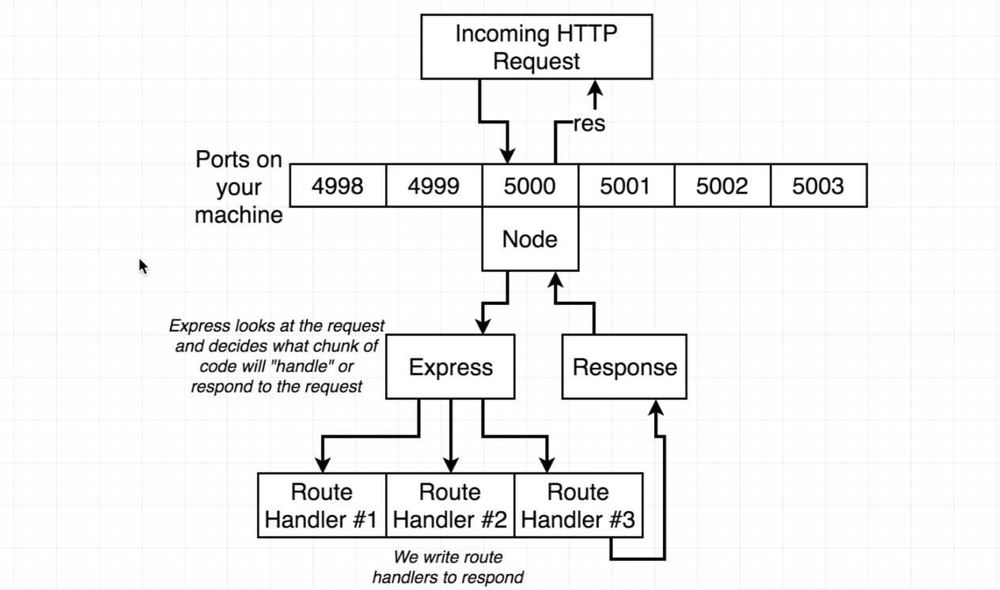

# Node with React: Fullstack Web Development Notes

This file contains all of the notes taken during the completion of the Node with React: Fullstack Web Development course by Stephen Grider on Udemy. The course can be found [here](https://www.udemy.com/course/node-with-react-fullstack-web-development/).

## Section 2: Server Side Architecture

* Node is a JavaScript runtime used to execute JavaScript code outside of the browser
* Express is a library that runs in the Node runtime and has helpers to make dealing with HTTP traffic easier\
  * You can think of Express as a library of helpers for making interaction with Node's HTTP/HTTPS modules easier

* By convention, we name the index file of a node project `index.js`
* To gain access to the Express module inside of a JavaScript file, we can write `const express = require('express');`
  * The `require` method is a method that allows us to take advantage of commonJS modules on the server side. We have to use this because currently NodeJS only allows use of CommonJS modules and does not support the `import` token.
* The `const app = express();` statement generates a new application that represents a running express application

### Heroku Deployment

* Deployment Checklist
  1. Dynamic Port Binding: Heroku tells us which port our app will use, so we need to make sure we listen to the port they tell us to
  2. Specific Node Environment: We want to use a specific version of Node, so we need to tell Heroku which version we want
  3. Specify Start Script: Instruct Heroku on what command to run to start our server
  4. Create .gitignore: We don't want to include dependencies, Heroku will do that for us